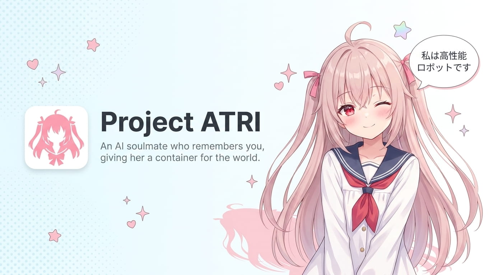

<h1 align="center">ATRI</h1>



<p align="center">
  <b>An AI Companion That Remembers You — Persistent Memory with 3-Layer Compression</b>
</p>

<p align="center">
  <a href="https://github.com/JuyaoHuang/atri/blob/main/LICENSE"></a>
  
  
  
  
</p>

<p align="center">
  <a href="README.md">中文</a> ·
  <a href="#-quickstart">Quick Start</a> ·
  <a href="#-highlights">Highlights</a> ·
  <a href="#-tech-stack">Tech Stack</a> ·
  <a href="#-documentation">Documentation</a> ·
  <a href="#license">License</a>
</p>

---

## 👀 Preview

| Dark Mode | Light Mode |
|:---:|:---:|
|  |  |
|  |  |

---

## ⭐ About

Most AI chat tools feel like they have amnesia — you mention your favorite drink yesterday, and today they ask again "What do you like to drink?"

**ATRI is different.** The core is a 3-layer memory compression system inspired by human brain memory:
- **L1**: Automatic noise filtering on every message
- **L3**: Event-level summaries every 26 rounds
- **L4**: Long-term personality profiles every 4 summaries

Paired with [mem0](https://github.com/mem0ai/mem0)'s cross-session vector retrieval, ATRI remembers your preferences, emotional shifts, and unfinished topics — and brings them up at the right moment.

**Simply put: The longer you talk, the better she understands.**

ATRI is also a fully-featured AI character companion platform — Live2D avatars, voice conversation, custom personas, multi-user isolation, works out of the box.

> Project named after Atri from the game *ATRI -My Dear Moments-*, my favorite high-performance android.

---

## ✨ Features

### 🧠 Memory System

- **3-Layer Compression**: L1 rule-based cleaning → L3 event summaries → L4 pattern profiles, context never lost
- **Long-Term Memory**: mem0 saves cross-session user facts, preferences, and emotional trends
- **Recoverable**: `chat_history` is source of truth; `short_term_memory` auto-recovers if corrupted
- **Session Isolation**: Each character, each user has independent memory space

### 💬 Conversation Experience

- **Streaming Output**: WebSocket pushes LLM chunks in real-time, character-by-character display, no waiting
- **Chat Management**: ChatGPT-style sidebar — history list, auto-title generation, new/delete sessions
- **Character Switching**: Multi-character personas, each with independent memory and greeting
- **Real-Time Awareness**: AI knows what time it is, conversations feel natural

### 🎨 Interface & Interaction

- **Live2D Stage**: Backend hosts model assets, frontend PixiJS renders with expression and idle animations
- **Dual Layout**: 
- **Dual Themes**: Dark/light mode with one click
- **Custom Backgrounds**: Upload your favorite image, adjust transparency
- **AIRI-Inspired UI**: Design language from [AIRI](https://github.com/moeru-ai/airi)

### 🎙️ Voice Pipeline

- **ASR Voice Input**: Faster Whisper / Whisper.cpp / OpenAI Whisper / Browser Web Speech API
- **TTS Voice Output**: Edge TTS / GPT-SoVITS / SiliconFlow / CosyVoice3
- **Floating Player**: Custom progress bar, drag to seek, queue display
- **Modular Toggle**: ASR and TTS are optional plugins, enable as needed

### 🔐 Deployment & Auth

- **Local-Friendly**: Zero-config single-machine use with auth disabled
- **Internet-Ready**: GitHub OAuth + JWT + whitelist, multi-user data isolation when enabled
- **Layered Config**: `config.yaml` references sub-configs, modular management

---

## 🚀 Quick Start

See [Quick Start Guide](docs/quickstart.md) for installation and setup.

After starting the backend, access auto-generated API docs:

- Swagger UI: `http://localhost:8430/docs`
- OpenAPI JSON: `http://localhost:8430/openapi.json`

---

## 🛠️ Tech Stack

| Layer | Technology |
|---|---|
| **Backend Framework** | FastAPI + Uvicorn |
| **LLM** | OpenAI-compatible interface (DeepSeek, SiliconFlow, etc.) |
| **Memory** | 3-layer compression + mem0 (SaaS / Qdrant local deploy) |
| **Storage** | Local JSON (extensible to database) |
| **Auth** | GitHub OAuth + JWT |
| **Frontend Framework** | Vue 3 + TypeScript + Vite |
| **State Management** | Pinia |
| **Styling** | UnoCSS |
| **Live2D** | PixiJS + pixi-live2d-display |
| **Voice** | ASR / TTS multi-provider factory pattern |

---

## 📖 Documentation

| Document | Description |
|---|---|
| [Architecture](docs/developments/项目架构设计.md) | ATRI's overall project architecture |
| [Auth System Guide](docs/configs/认证系统使用指南.md) | GitHub OAuth and whitelist setup |
| [ASR Config](docs/configs/ASR配置说明.md) | Speech recognition provider setup |
| [TTS Config](docs/configs/TTS配置说明.md) | Text-to-speech provider setup |
| [Character Guide](docs/configs/角色创建指南.md) | Create character personas, avatars, greetings |

**For developers**: See [CONTRIBUTING.md](CONTRIBUTING.md) for development guides and module-specific documentation.

---

## 🏗️ Project Structure

```
atri/
├── src/                # Backend source
│   ├── agent/          #   ChatAgent + Persona
│   ├── memory/         #   3-layer compression + session management
│   ├── llm/            #   LLM call layer (factory pattern)
│   ├── asr/            #   ASR providers
│   ├── tts/            #   TTS providers
│   ├── auth/           #   Authentication system
│   ├── storage/        #   Storage abstraction layer
│   ├── routes/         #   FastAPI routes
│   └── utils/          #   Config loading + logging
├── config/             # Layered config files
├── prompts/            # Character personas + compression prompts
├── data/               # Runtime data / avatars / Live2D models
├── tests/              # Backend tests
└── atri-webui/         # Frontend (submodule)
```

---

## 贡献 / Contributing

Welcome to contribute to ATRI! Read [CONTRIBUTING.md](CONTRIBUTING.md) to learn:

- Development environment setup
- Branch and PR workflow
- Code standards
- **Documentation Guide** — choose docs by module (backend / frontend / TTS / ASR / Live2D)

---

## 🙏 Acknowledgments

ATRI stands on the shoulders of excellent projects:

- [Open-LLM-VTuber](https://github.com/Open-LLM-VTuber/Open-LLM-VTuber) — ASR / TTS factory pattern reference
- [AIRI](https://github.com/moeru-ai/airi) — Frontend UI design, Live2D integration reference
- [mem0](https://github.com/mem0ai/mem0) — Long-term memory foundation

---

## License

[CC BY-NC 4.0](./LICENSE)
